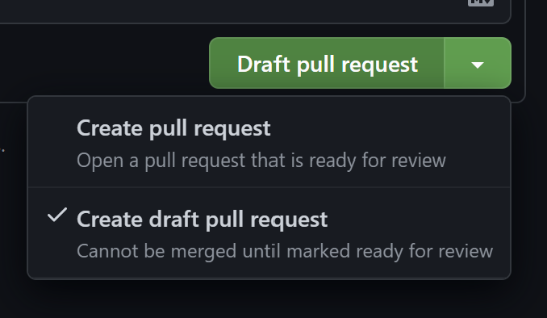

# デジコア v3 フロントエンド

芝浦工業大学デジクリが部員管理やイベント、作品の管理に利用しているグループウェア「デジコア」のフロントエンド

[core3.digicre.net](https://core3.digicre.net)にて公開

## 開発環境セットアップ方法

Windows にて開発している方は WSL などの環境で開発することをおすすめします。

### VSCode の拡張機能のインストール

VSCodeで開発を行う場合は、`oxc.oxc-vscode`をインストールしてください。

https://marketplace.visualstudio.com/items?itemName=oxc.oxc-vscode

### pnpm のインストール

node のパッケージマネージャー`pnpm`をインストールします。

`pnpm-lock.yaml`などが壊れるので`npm`は使用しないで下さい。

```bash
npm i -g pnpm
```

すでに pnpm をインストールしている場合は、v10 以上であることを確認してください。

### パッケージのインストール

```bash
pnpm install
```

### 開発用サーバーの起動

コードを変更し保存すると反映されるようになっている(ホットリロードが有効化されている)ので開発サーバーを起動しながらコーディングが可能です。

```bash
pnpm run dev
```

### バックエンドAPIの型定義の生成

バックエンドの実装が変更されたら、[`/document/bundle.gen.yml`](https://github.com/SIT-DigiCre/digicore_v3_backend/blob/master/document/bundle.gen.yml)をコピーしてきて、`/utils/fetch/bundle.gen.yml`に貼り付けてください。その後`pnpm generate`を実行すると、新しい型定義が生成されます。

### oxlint のエラーについて

インポートの順序がアルファベット順ではない場合などに警告が出ます。手動で修正しても良いですが、`pnpm run lint:fix`を実行すると自動で修正されます。

## 機能の開発の仕方

### ブランチの命名

ブランチは以下の命名規則を守ってください

- 新機能の開発の場合 => `feature/(機能の名前)`
- => `enhance/(機能の名前)`
- バグなどの修正の場合 => `fix/(機能の名前)`

機能の名前は`blog-post`のような命名でお願いします。

例）  
ブログの投稿機能を作る場合  
`feature/blog-post`

### Draft PR の作成

少しでも作業が進み、コミットができたら、リモートにプッシュしてドラフトプルリクエストを作成します。

概要の部分には作業した項目やこれから作業することを ToDo 形式で記入します。


ブログ投稿機能作成の例

```markdown
- [ ] ブログ投稿作成ページの作成
- [ ] ブログ投稿閲覧ページの作成
- [ ] ブログ一覧閲覧ページの作成
```

書けたら**Draft pull request**で作成します。



### がんばって作る

頑張って作ります

### PR の整備とレビューの準備

PR で行っている ToDo が完了して master に Merge する準備ができたら、レビューを受けるためにプルリクエストの内容をよりよくしていきます。
再度、概要で定義した ToDo をやっているかはもちろん確認してください。  
その他、新しい機能の場合はどんな感じかがわかるスクリーンショットをはったり、修正した場合は前と後でスクショがあるとわかりやすいです。

また、破壊的変更がないかや最後のチェック項目も確認しましょう。

ここまでできたらレビュワーを指定します。
GitHub の`Reviewers`の歯車ボタンをクリックしてレビュ依頼をする人を選択します。


### Mattermost で報告

GitHub の通知だけでは気づきにくいので、Mattermost の`~system-development`チャンネルにてメンション付きでレビュー依頼を PR の URL 付きで送りましょう。

### Approve されたら

Approve されたら PR 内の Merge ボタンを押し、Merge を実行します。Merge されたら Delete branch ボタンで対象のブランチを削除しましょう。
これで一連の作業は終わりです。
